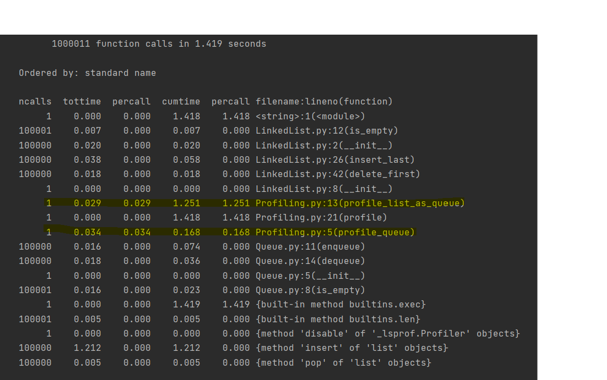

# Master DataStructures in Python

Implementation of the following datastructures:

* Nodes
* LinkedList
* Queue
* Stack
* DoubleLinkedList

Showing how to perform profiling and demonstrate that Queue with LinkedList is faster (having linear time) than  
using Queue with python list standard libraries.  

Inspired by the Udemy course [Master Data Structures for Optimal Solutions in Python
](https://www.udemy.com/course/learn-linked-lists-stacks-and-queues-in-python/)
